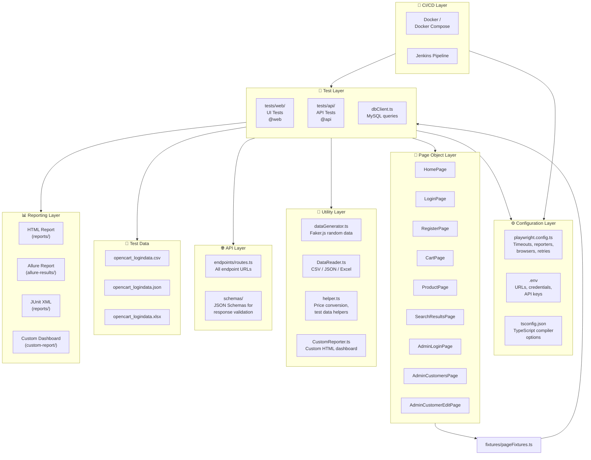
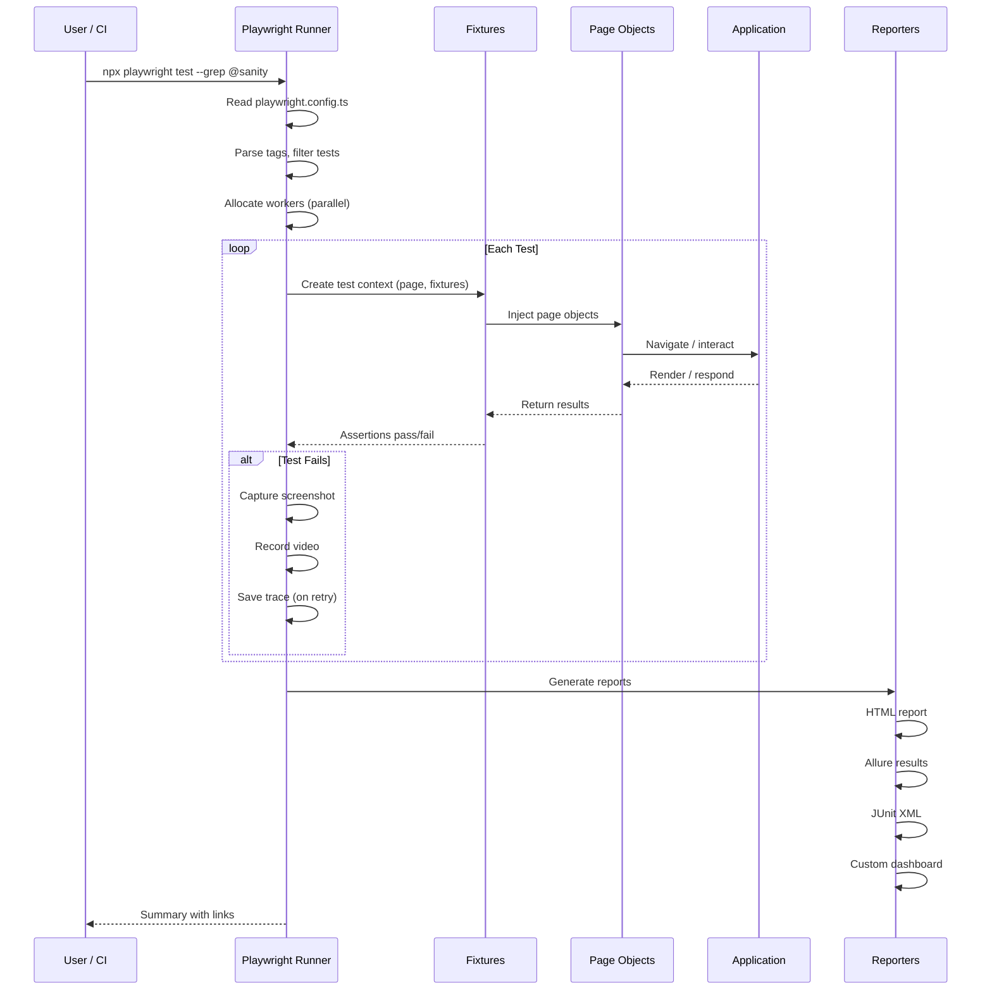
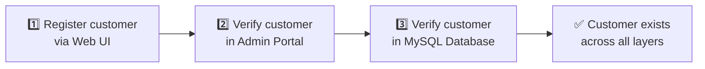
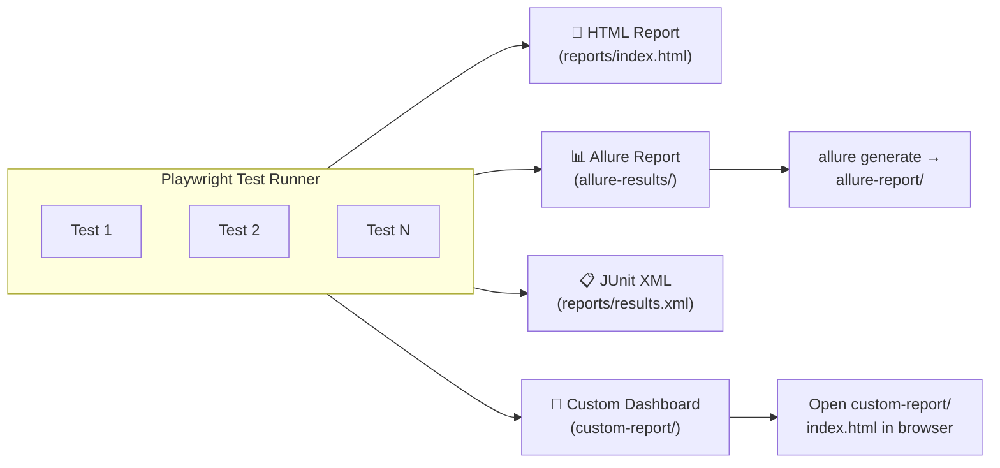
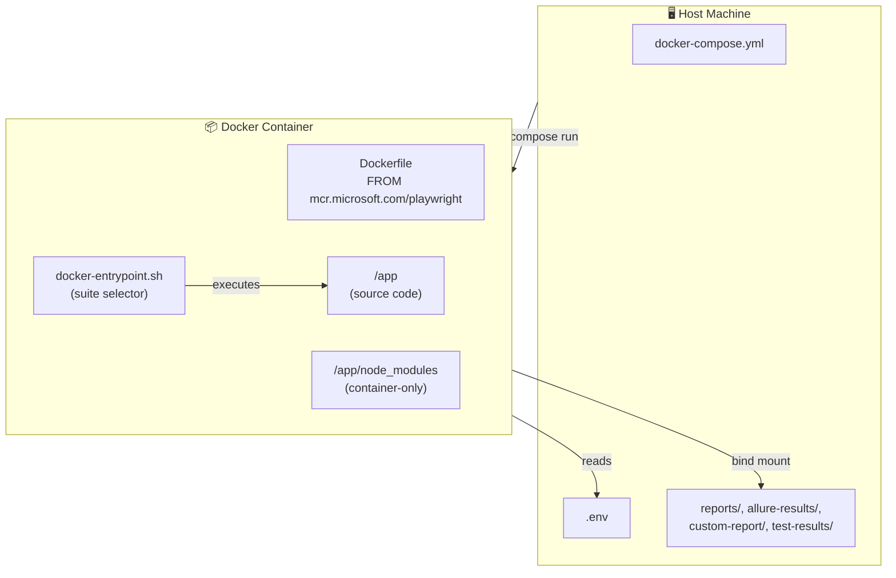
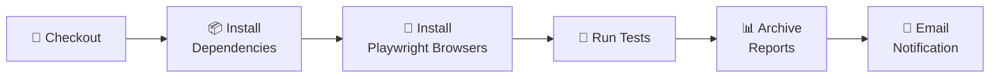

# 🎭 Playwright + TypeScript Automation Framework

> **A production-grade, multi-layer test automation framework** for **Web UI**, **REST API**, and **Database** testing — built with Playwright, TypeScript, and the Page Object Model pattern.

[](https://playwright.dev)
[](https://www.typescriptlang.org/)
[](https://allurereport.com/)
[](https://www.jenkins.io/)
[](https://www.docker.com/)
[](https://nodejs.org/)

---

## 📖 Table of Contents

- [Overview](#-overview)
- [Key Features](#-key-features)
- [Framework Architecture](#-framework-architecture)
- [Project Structure](#-project-structure)
- [Tech Stack](#-tech-stack)
- [Prerequisites](#-prerequisites)
- [Quick Start](#-quick-start)
- [Environment Configuration](#-environment-configuration)
- [Test Suites & Tags](#-test-suites--tags)
- [Running Tests](#-running-tests)
- [Test Execution Flow](#-test-execution-flow)
- [Page Object Model](#-page-object-model)
- [API Testing](#-api-testing)
- [Database Testing](#-database-testing)
- [Data-Driven Testing](#-data-driven-testing)
- [Reporting](#-reporting)
- [Docker Setup](#-docker-setup)
- [CI/CD with Jenkins](#-cicd-with-jenkins)
- [Utilities](#-utilities)
- [Contributing](#-contributing)
- [License](#-license)

---

## 🎯 Overview

This framework provides a **unified, scalable automation solution** for testing the **OpenCart e-commerce platform** across three layers:

| Layer           | Technology                                  | What We Test                                                                       |
| --------------- | ------------------------------------------- | ---------------------------------------------------------------------------------- |
| 🌐 **Web UI**   | Playwright + Page Object Model              | Customer registration, login/logout, product search, cart management, admin portal |
| 🔌 **REST API** | Playwright `request` fixture + FakeStoreAPI | Products, users, carts, authentication, schema validation                          |
| 🗄️ **Database** | MySQL2 + Admin Portal                       | End-to-end customer registration with DB verification                              |

It is designed for **CI/CD integration** (Jenkins + Docker), supports **multiple reporting formats**, and follows **industry best practices** for maintainability and readability.

---

## ✨ Key Features

- ✅ **Page Object Model (POM)** — 12 reusable page classes for clean test code
- ✅ **Custom Test Fixtures** — Type-safe dependency injection for all page objects
- ✅ **Multi-Layer Testing** — Web UI + REST API + Database in a single framework
- ✅ **Tag-Based Test Suites** — `@sanity`, `@regression`, `@api`, `@web`, `@e2e`, `@master`, `@datadriven`
- ✅ **Data-Driven Testing** — CSV, JSON, and Excel test data sources
- ✅ **Random Test Data Generation** — Powered by Faker.js
- ✅ **Schema Validation** — JSON Schema validation for API responses via AJV
- ✅ **Accessibility Checks** — WCAG compliance testing via axe-core
- ✅ **Multiple Reporters** — HTML, Allure, JUnit XML, Custom HTML dashboard
- ✅ **Parallel Execution** — Fully parallel test execution with configurable workers
- ✅ **CI/CD Ready** — Jenkins pipeline + Docker Compose support
- ✅ **Retries & Artifacts** — Automatic retries, screenshots, videos, and traces on failure

---

## 🏗️ Framework Architecture



---

## 📁 Project Structure

```mermaid
graph TD
    ROOT["📦 playwright-opencart-ai/"] --> CONF["⚙️ Config Files"]
    ROOT --> SRC["📂 Source Code"]
    ROOT --> TEST["🧪 Tests"]
    ROOT --> DATA["📁 Test Data"]
    ROOT --> REPORTS["📊 Reports"]
    ROOT --> INFRA["🐳 Infrastructure"]

    CONF --> PC["playwright.config.ts"]
    CONF --> TS["tsconfig.json"]
    CONF --> PKG["package.json"]
    CONF --> ENV[".env.example"]
    CONF --> DI[".dockerignore"]
    CONF --> GI[".gitignore"]

    SRC --> PAGES["pages/<br/>12 Page Objects"]
    SRC --> UTILS["utils/<br/>5 Utilities"]
    SRC --> FIXTURES["fixtures/<br/>pageFixtures.ts"]
    SRC --> API["api/<br/>endpoints + schemas"]

    TEST --> WEB["tests/web/<br/>8 UI test specs"]
    TEST --> API_T["tests/api/<br/>8 API test specs"]
    TEST --> DB_T["tests/db/<br/>1 E2E DB spec"]

    DATA --> CSV["*.csv"]
    DATA --> JSON["*.json"]
    DATA --> XLSX["*.xlsx"]

    REPORTS --> HTML["reports/"]
    REPORTS --> ALLURE["allure-results/"]
    REPORTS --> CUSTOM["custom-report/"]
    REPORTS --> TR["test-results/"]

    INFRA --> DOCKER["Dockerfile"]
    INFRA --> DC["docker-compose.yml"]
    INFRA --> ENTRY["docker-entrypoint.sh"]
    INFRA --> JENKINS["Jenkinsfile"]
    INFRA --> SETUP["env_setup.bat"]
```



### 📂 Folder Breakdown

| Path              | Purpose                                                                 |
| ----------------- | ----------------------------------------------------------------------- |
| `pages/`          | Page Object classes — each encapsulates locators + actions for a page   |
| `fixtures/`       | Custom Playwright test fixtures for type-safe page object injection     |
| `tests/web/`      | Web UI test specs (login, registration, cart, search, etc.)             |
| `tests/api/`      | REST API test specs against FakeStoreAPI                                |
| `tests/db/`       | Database validation tests (MySQL)                                       |
| `api/endpoints/`  | Centralized API route definitions                                       |
| `api/schemas/`    | JSON Schema files for API response validation                           |
| `utils/`          | Shared utilities (data generation, readers, DB client, custom reporter) |
| `testdata/`       | External test data files (CSV, JSON, Excel)                             |
| `reports/`        | Generated HTML + JUnit reports                                          |
| `allure-results/` | Allure-compatible test result files                                     |
| `custom-report/`  | Custom HTML dashboard output                                            |
| `test-results/`   | Playwright test artifacts (screenshots, videos, traces)                 |
| `docs/`           | Additional documentation                                                |
| `prompts/`        | AI prompt templates for test generation                                 |

---

## 🛠️ Tech Stack

| Technology                                                           | Version | Purpose                          |
| -------------------------------------------------------------------- | ------- | -------------------------------- |
| [Playwright](https://playwright.dev/)                                | ^1.62.1 | Browser automation & API testing |
| [TypeScript](https://www.typescriptlang.org/)                        | 5.x     | Type-safe test code              |
| [Node.js](https://nodejs.org/)                                       | 20+     | Runtime                          |
| [Allure Playwright](https://www.npmjs.com/package/allure-playwright) | ^3.10.2 | Allure reporting integration     |
| [Faker.js](https://fakerjs.dev/)                                     | ^10.5.0 | Random test data generation      |
| [AJV](https://ajv.js.org/)                                           | ^8.20.0 | JSON Schema validation           |
| [axe-core](https://www.npmjs.com/package/@axe-core/playwright)       | ^4.13.0 | Accessibility (WCAG) testing     |
| [Luxon](https://moment.github.io/luxon/)                             | ^3.7.2  | Date/time manipulation           |
| [MySQL2](https://www.npmjs.com/package/mysql2)                       | ^3.23.3 | MySQL database connectivity      |
| [csv-parse](https://www.npmjs.com/package/csv-parse)                 | ^7.0.2  | CSV file parsing                 |
| [xlsx](https://www.npmjs.com/package/xlsx)                           | ^0.18.5 | Excel file parsing               |
| [dotenv](https://www.npmjs.com/package/dotenv)                       | ^17.4.2 | Environment variable management  |

---

## 📋 Prerequisites

Before you begin, ensure you have the following installed:

- **Node.js** v20 or later → [Download](https://nodejs.org/)
- **npm** v9+ (comes with Node.js)
- **Git** → [Download](https://git-scm.com/)
- **Playwright browsers** (installed via setup script)
- **Docker Desktop** (optional, for containerized execution) → [Download](https://www.docker.com/products/docker-desktop/)
- **Java 11+** (optional, for Allure reporting) → [Download](https://adoptium.net/)

---

## 🚀 Quick Start

### 1️⃣ Clone the Repository

```bash
git clone <repository-url>
cd playwright-opencart-ai
```

### 2️⃣ Install Dependencies

```bash
npm install
```

### 3️⃣ Install Playwright Browsers

```bash
npx playwright install --with-deps
```

### 4️⃣ Configure Environment

```bash
cp .env.example .env
```

Edit `.env` with your application URLs and credentials (see [Environment Configuration](#-environment-configuration)).

### 5️⃣ Run All Tests

```bash
npx playwright test
```

---

## 🔧 Environment Configuration

The framework uses a `.env` file for all configurable settings. Copy `.env.example` to `.env` and update the values:

```env
# Environment
APP_ENV=qa                          # qa | prod | dev

# Web Application
WEB_APP_URL=https://awesomeqa.com/ui/
APP_EMAIL=your-email@example.com
APP_PASSWORD=your-password

# Product Details (for cart tests)
PRODUCT_NAME=MacBook
PRODUCT_QUANTITY=1
TOTAL_PRICE=$602.00

# API (FakeStoreAPI)
API_BASE_URL=https://fakestoreapi.com
USERNAME=mor_2314
PASSWORD=83r5^_
USER_ID=1
PRODUCT_ID=1
CART_ID=1
LIMIT=3
START_DATE=2019-12-10
END_DATE=2020-10-10

# Database (MySQL)
DB_HOST=localhost
DB_PORT=3306
DB_USER=root
DB_PASSWORD=your-db-password
DB_NAME=opencart

# Admin Portal
ADMIN_URL=http://localhost/opencart/upload/admin/index.php
ADMIN_USERNAME=admin
ADMIN_PASSWORD=admin123
```

---

## 🏷️ Test Suites & Tags

Tests are organized using Playwright's tag system (`@tag-name` in test titles). Each tag maps to a reusable npm script:

| Tag           | npm Script                | Description                                  |
| ------------- | ------------------------- | -------------------------------------------- |
| `@master`     | `npm run test:master`     | **Master suite** — all critical tests        |
| `@sanity`     | `npm run test:sanity`     | **Sanity checks** — quick smoke tests        |
| `@regression` | `npm run test:regression` | **Full regression** — comprehensive coverage |
| `@web`        | `npm run test:web`        | **Web UI tests only**                        |
| `@api`        | `npm run test:api`        | **API tests only**                           |
| `@e2e`        | `npm run test:e2e`        | **End-to-end scenarios**                     |
| `@datadriven` | `npm run test:datadriven` | **Data-driven tests**                        |

Tests can carry **multiple tags** for flexible execution:

```typescript
test('Valid Login Flow @master @sanity @regression @web', async (...) => { ... });
test('GET - All Products @master @sanity @api', async (...) => { ... });
test('Register customer, verify in admin portal and MySQL @master @end-to-end @db', async (...) => { ... });
```

---

## ▶️ Running Tests

### Run All Tests

```bash
npx playwright test
```

### Run by Tag (npm scripts)

```bash
npm run test:sanity          # Sanity tests only
npm run test:regression      # Regression tests
npm run test:web             # Web UI tests
npm run test:api             # API tests
npm run test:e2e             # End-to-end tests
npm run test:master          # Master suite
npm run test:datadriven      # Data-driven tests
```

### Run in Headed Mode (with browser visible)

```bash
npm run test:master:headed
```

### Run with Debugging

```bash
npm run test:sanity:debug    # Opens Playwright Inspector
```

### Run a Single Test File

```bash
npx playwright test tests/web/valid-login.spec.ts
```

### Run with Specific Project / Browser

```bash
npx playwright test --project=chromium
```

### Run with grep (custom tag filter)

```bash
npx playwright test --grep "@sanity"
npx playwright test --grep "@api|@web"    # Multiple tags
```

### Run in CI Mode (headless, 2 retries, 1 worker)

```bash
set CI=true && npx playwright test
```

---

## 🔄 Test Execution Flow



---

## 📄 Page Object Model

The framework uses the **Page Object Model (POM)** pattern to separate test logic from page-specific implementation details.

### How It Works

Each web page gets its own **Page Object class** that encapsulates:

- **Locators** — CSS selectors / Playwright getters for elements
- **Actions** — Methods that perform operations (click, fill, select)
- **Verifications** — Methods that check state (isVisible, getText)

### Available Page Objects

| Class                   | File                             | Key Methods                                                          |
| ----------------------- | -------------------------------- | -------------------------------------------------------------------- |
| `HomePage`              | `pages/HomePage.ts`              | `navigateTo()`, `searchProduct()`, `clickLogin()`, `clickRegister()` |
| `LoginPage`             | `pages/LoginPage.ts`             | `login()`, `isLoginPageExists()`, `getWarningMessage()`              |
| `RegisterPage`          | `pages/RegisterPage.ts`          | `completeRegistration()`, `isRegisterPageExists()`                   |
| `MyAccountPage`         | `pages/MyAccountPage.ts`         | `isMyAccountPageExists()`, `isAuthenticated()`, `clickLogout()`      |
| `SuccessPage`           | `pages/SuccessPage.ts`           | `isSuccessPageExists()`, `getSuccessHeadingText()`                   |
| `LogoutPage`            | `pages/LogoutPage.ts`            | `isLogoutPageExists()`, `clickContinue()`                            |
| `SearchResultsPage`     | `pages/SearchResultsPage.ts`     | `isProductDisplayed()`, `getSearchHeadingText()`                     |
| `ProductPage`           | `pages/ProductPage.ts`           | `getProductName()`, `getProductPrice()`, `addToCart()`               |
| `CartPage`              | `pages/CartPage.ts`              | `isCartPageExists()`, `isProductInCart()`, `getTotalPrice()`         |
| `AdminLoginPage`        | `pages/AdminLoginPage.ts`        | `login()`, `isAdminLoginPageExists()`                                |
| `AdminCustomersPage`    | `pages/AdminCustomersPage.ts`    | `dismissSecurityModal()`, `searchByEmail()`, `clickEditCustomer()`   |
| `AdminCustomerEditPage` | `pages/AdminCustomerEditPage.ts` | `isEditCustomerPageExists()`, `getFirstNameValue()`                  |

### Example: Page Object

```typescript
// pages/LoginPage.ts
export class LoginPage {
  private readonly emailInput: Locator;
  private readonly passwordInput: Locator;
  private readonly loginButton: Locator;

  constructor(page: Page) {
    this.emailInput = page.locator("#input-email");
    this.passwordInput = page.locator("#input-password");
    this.loginButton = page.getByRole("button", { name: "Login" });
  }

  async login(email: string, password: string): Promise<void> {
    await this.emailInput.fill(email);
    await this.passwordInput.fill(password);
    await this.loginButton.click();
  }

  async isLoginPageExists(): Promise<boolean> {
    return await this.loginHeading.isVisible();
  }
}
```

### Custom Fixtures (Dependency Injection)

Page objects are injected into tests via **custom fixtures** (`fixtures/pageFixtures.ts`), providing type-safe, automatic initialization:

```typescript
// fixtures/pageFixtures.ts
import { test as base } from "@playwright/test";
import { HomePage } from "../pages/HomePage";
import { LoginPage } from "../pages/LoginPage";

export const test = base.extend({
  homePage: async ({ page }, use) => {
    await page.goto(APP_URL);
    await use(new HomePage(page));
  },
  loginPage: async ({ page }, use) => {
    await use(new LoginPage(page));
  },
});

export { expect } from "@playwright/test";
```

### Example: Test Using Fixtures

```typescript
// tests/web/valid-login.spec.ts
import { test, expect } from "../../fixtures/pageFixtures";
import { Helper } from "../../utils/helper";

test("Valid Login Flow @master @sanity @regression @web", async ({
  homePage,
  loginPage,
  myAccountPage,
}) => {
  const { email, password } = Helper.getLoginDetails();

  await test.step("1) Open the application", async () => {
    await homePage.navigateTo(process.env.WEB_APP_URL!);
  });

  await test.step("2) Navigate to My Account → Login", async () => {
    await homePage.clickMyAccount();
    await homePage.clickLogin();
  });

  await test.step("3) Enter valid credentials and submit", async () => {
    await loginPage.login(email, password);
  });

  await test.step("4) Verify successful authentication", async () => {
    const isAuth = await myAccountPage.isAuthenticated();
    expect(isAuth).toBeTruthy();
  });
});
```

---

## 🌐 API Testing

The framework tests the [FakeStoreAPI](https://fakestoreapi.com/) — a free REST API for e-commerce.

### API Layer Structure

```
api/
├── endpoints/
│   └── routes.ts          # Centralized route definitions
└── schemas/
    ├── product_api_schema.json
    ├── user_api_schema.json
    └── cart_api_schema.json
```

### Route Definitions

All API endpoints are centralized in `api/endpoints/routes.ts`:

```typescript
export const Routes = {
  BASE_URL: "https://fakestoreapi.com",
  GET_ALL_PRODUCTS: "/products",
  GET_PRODUCT_BY_ID: "/products/{id}",
  CREATE_PRODUCT: "/products",
  GET_ALL_USERS: "/users",
  GET_ALL_CARTS: "/carts",
  AUTH_LOGIN: "/auth/login",
  // ... more routes
};
```

### API Test Example

```typescript
// tests/api/products.spec.ts
import { test, expect } from "@playwright/test";
import { Routes } from "../../api/endpoints/routes";

test("GET - All Products @master @sanity @api", async ({ request }) => {
  const response = await request.get(`${BASE_URL}${Routes.GET_ALL_PRODUCTS}`);
  expect(response.status()).toBe(200);

  const products = await response.json();
  expect(Array.isArray(products)).toBeTruthy();
  expect(products.length).toBeGreaterThan(0);

  products.forEach((product: any) => {
    expect(product).toHaveProperty("id");
    expect(product).toHaveProperty("title");
    expect(product).toHaveProperty("price");
  });
});
```

### API Test Coverage

| Test File                       | Endpoints Covered                        |
| ------------------------------- | ---------------------------------------- |
| `products.spec.ts`              | GET all, GET by ID, CRUD operations      |
| `users.spec.ts`                 | GET all, GET by ID, CRUD operations      |
| `carts.spec.ts`                 | GET all, GET by ID, CRUD operations      |
| `auth.spec.ts`                  | POST login authentication                |
| `schema-validation.spec.ts`     | JSON Schema validation for all endpoints |
| `product-crud-workflow.spec.ts` | Full CRUD workflow for products          |
| `user-crud-workflow.spec.ts`    | Full CRUD workflow for users             |
| `cart-crud-workflow.spec.ts`    | Full CRUD workflow for carts             |

---

## 🗄️ Database Testing

The framework validates data persistence by querying **MySQL** directly via the `mysql2` library.

### DB Client

```typescript
// utils/dbClient.ts
import mysql from "mysql2/promise";

export async function executeQuery(sql: string, params?: any[]) {
  const connection = await mysql.createConnection({
    host: process.env.DB_HOST,
    port: Number(process.env.DB_PORT),
    user: process.env.DB_USER,
    password: process.env.DB_PASSWORD,
    database: process.env.DB_NAME,
  });
  const [result] = await connection.execute(sql, params);
  await connection.end();
  return result;
}
```

### E2E Test Flow (UI → Admin → DB)

The `customer-registration-e2e.spec.ts` demonstrates a **three-layer validation**:



```typescript
// Step 1: Register via UI
await registerPage.completeRegistration(
  firstName,
  lastName,
  email,
  telephone,
  password,
);

// Step 2: Verify in Admin Portal
await adminLoginPage.login(ADMIN_USERNAME, ADMIN_PASSWORD);
await adminCustomersPage.searchByEmail(email);
const isFound = await adminCustomersPage.isCustomerInTable(email);

// Step 3: Verify in MySQL
const rows = await executeQuery("SELECT * FROM oc_customer WHERE email = ?", [
  email,
]);
expect(rows.length).toBe(1);
expect(rows[0].firstname).toBe(firstName);
```

---

## 📊 Data-Driven Testing

The framework supports **three external data formats** for data-driven tests:

| Format    | Reader                     | File Example                       |
| --------- | -------------------------- | ---------------------------------- |
| **CSV**   | `DataProvider.readCsv()`   | `testdata/opencart_logindata.csv`  |
| **JSON**  | `DataProvider.readJson()`  | `testdata/opencart_logindata.json` |
| **Excel** | `DataProvider.readExcel()` | `testdata/opencart_logindata.xlsx` |

### Data Reader Utility

```typescript
// utils/DataReader.ts
export class DataProvider {
  static readJson(filePath: string) {
    /* ... */
  }
  static readCsv(filePath: string) {
    /* ... */
  }
  static readExcel(filePath: string) {
    /* ... */
  }
}
```

### Random Data Generation

For non-deterministic test data, use the `RandomDataUtil` class powered by Faker.js:

```typescript
import { RandomDataUtil } from "../../utils/dataGenerator";

const firstName = RandomDataUtil.getFirstName();
const lastName = RandomDataUtil.getLastName();
const email = RandomDataUtil.getEmail();
const password = RandomDataUtil.getPassword(12);
const phone = RandomDataUtil.getPhoneNumber();
const address = RandomDataUtil.getStreetAddress();
```

---

## 📊 Reporting

The framework generates **four types of reports** simultaneously:



### 1️⃣ Playwright HTML Report

```bash
# Auto-generated after test run
open reports/index.html
```


### 2️⃣ Allure Report

```bash
# Generate and serve Allure report
npx allure generate allure-results --clean -o allure-report
npx allure open allure-report
```


### 3️⃣ JUnit XML Report

Generated at `reports/results.xml` — compatible with Jenkins CI integration.

### 4️⃣ Custom HTML Dashboard

A custom reporter (`utils/CustomReporter.ts`) generates a branded HTML dashboard with:

- Test pass/fail/skip statistics
- Step-by-step execution details
- Screenshot attachments on failure
- Console logs per test step
- Video and trace links
- Timeline and chart visualizations

Open `custom-report/index.html` in a browser to view.


---

## 🐳 Docker Setup

Run tests in a **consistent, isolated container environment** — no local dependencies needed.

### Docker Architecture



### Build the Image

```bash
docker compose build
```

### Run Test Suites

```bash
# Run all tests
docker compose run --rm playwright-tests

# Run specific suites
docker compose run --rm playwright-tests sanity
docker compose run --rm playwright-tests regression
docker compose run --rm playwright-tests web
docker compose run --rm playwright-tests api
docker compose run --rm playwright-tests master
docker compose run --rm playwright-tests e2e
docker compose run --rm playwright-tests datadriven
```

### Pass Extra Playwright Arguments

```bash
docker compose run --rm playwright-tests web --headed --workers 2
```

### Key Docker Features

- **Layer caching** — `package*.json` copied first, `npm ci` cached unless deps change
- **Bind mounts** — Reports and artifacts persist on the host
- **Container-only `node_modules`** — Not shadowed by host bind mount
- **Entrypoint script** — Maps suite names to npm scripts automatically

---

## 🚇 CI/CD with Jenkins

The project includes a **declarative Jenkins pipeline** (`Jenkinsfile`) for Windows build agents.

### Pipeline Stages



### Pipeline Parameters

| Parameter    | Choices                                                                                                | Description             |
| ------------ | ------------------------------------------------------------------------------------------------------ | ----------------------- |
| `TEST_SUITE` | `test:e2e`, `test:master`, `test:sanity`, `test:regression`, `test:api`, `test:web`, `test:datadriven` | Which tests to run      |
| `BROWSER`    | `chromium`, `firefox`, `webkit`                                                                        | Browser selection       |
| `MODE`       | `headless`, `headed`                                                                                   | Headless or headed mode |

### Post-Build Actions

- ✅ Archives HTML reports
- ✅ Publishes JUnit XML results (test trend graph)
- ✅ Generates and publishes Allure reports
- ✅ Sends email notifications with status and report links
- ✅ Cleans up `allure-results` on success

---

## 🔧 Utilities

| Utility          | File                      | Purpose                                                                 |
| ---------------- | ------------------------- | ----------------------------------------------------------------------- |
| `RandomDataUtil` | `utils/dataGenerator.ts`  | Generate random names, emails, passwords, addresses, dates via Faker.js |
| `DataProvider`   | `utils/DataReader.ts`     | Read test data from CSV, JSON, and Excel files                          |
| `Helper`         | `utils/helper.ts`         | Price string-to-number conversion, static test data helpers             |
| `executeQuery`   | `utils/dbClient.ts`       | Execute MySQL queries with parameterized inputs                         |
| `CustomReporter` | `utils/CustomReporter.ts` | Custom Playwright reporter generating a rich HTML dashboard             |

---

## 📋 Coding Guidelines

- Follow the **Page Object Model** pattern for all UI interactions
- Use **tags** (`@tag`) to categorize every test
- Write **descriptive test names** and use `test.step()` for multi-step scenarios
- Keep **locators in page objects** — never in test files
- Use **fixtures** for dependency injection — never instantiate page objects manually
- Add **JSDoc comments** to all public methods
- Run `npx playwright test` locally before submitting

---

## 👨‍🏫 Author

<div >
    <h3>Mr. Pavan </h3>
    <p><em>Tech Educator & Trainer</em></p>
    <table>
        <tr>
            <td >🌐 <strong>Website</strong></td>
            <td><a href="https://www.pavanonlinetrainings.com">https://www.pavanonlinetrainings.com</a></td>
        </tr>
        <tr>
            <td >▶️ <strong>YouTube</strong></td>
            <td><a href="https://www.youtube.com/@sdetpavan">https://www.youtube.com/@sdetpavan</a></td>
        </tr>
    </table>
   
</div>

---

## 📄 License

This project is licensed under the **ISC License**.

---
